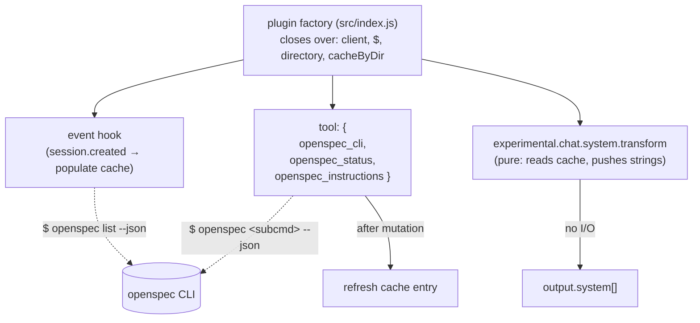
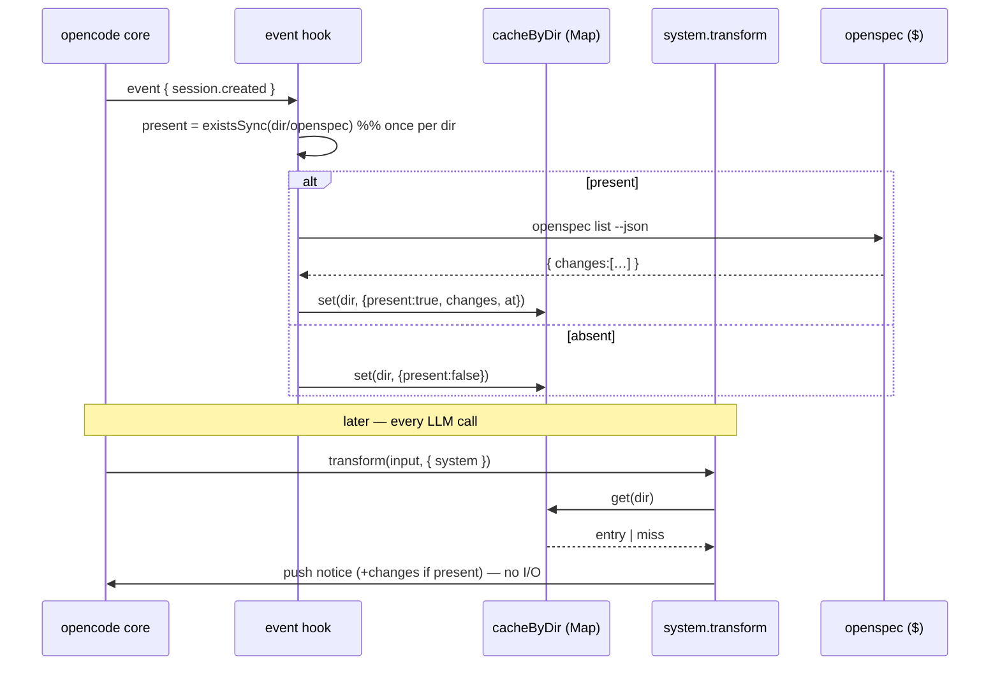

# Design — `opencode-openspec` plugin

## Context & scope

A single-file opencode plugin that wraps the OpenSpec CLI as three agent tools and injects
active-change context into the system prompt on every LLM call. Standalone ESM JavaScript, no
build step. This document covers the decisions that need making: the destructive-verb guard, the
injection cache lifecycle, `cwd` resolution, the error-handling tiers, tool return shapes, and the
test strategy. Verified platform facts (peer-dep, API surface, CLI behaviour) are treated as given
and not restated.

Greenfield — no existing system to map. The only prior artefact is this change's `proposal.md`;
one delta from it is flagged in [Requirement notes](#requirement-notes-for-the-engineer).

## Component overview

The plugin is **one module** (`src/index.js`) that exports a plugin factory. The factory receives
`PluginInput` (`{ client, project, directory, worktree, $, ... }`), holds a small amount of
closure state (the injection cache), and returns a `Hooks` object with three surfaces:



Internal helpers (`resolveCwd`, `runOpenspec`, `isDestructive`, `populateCache`, `logError`) live in
the same file. No `src/lib/` split at this scale; extract only if duplication appears.

## Tool interface

All tools resolve `cwd` identically (see [cwd resolution](#cwd-resolution)) and return their payload
as JSON serialized into `ToolResult.output` (the platform `ToolResult` is `string | { output, … }`;
structured data is stringified, and a compact copy may also be attached via `context.metadata`).

| Tool | Args | Returns (JSON in `output`) | Guard |
|---|---|---|---|
| `openspec_cli` | `command: string` (full subcommand+flags, e.g. `"list --json"`), `cwd?: string` | `{ stdout, stderr, exitCode }` | **Destructive-verb gate** via `context.ask` before spawn |
| `openspec_status` | `change: string`, `cwd?: string` | `{ isPlanningComplete, order: [{artifact, status}], raw }` overlaying canonical order | none (read-only) |
| `openspec_instructions` | `artifact: "proposal"\|"design"\|"specs"\|"tasks"`, `change: string`, `cwd?: string` | `{ template, instruction, resolvedOutputPath }` | none (read-only) |

Notes:
- `openspec_cli` is the full-surface escape hatch. A **non-zero CLI exit is a normal return**, not an
  error — the agent inspects `exitCode`/`stderr` itself (see [error handling](#error-handling)).
- `openspec_status` maps the CLI response onto the fixed authoring order **proposal → design → specs
  → tasks**. It surfaces `isPlanningComplete` (not the legacy `isComplete`) and does **not** headline
  the CLI's raw dependency graph — agents follow the fixed order, not the graph. The raw payload is
  retained under `raw` for the escape-hatch case.
- `openspec_instructions` returns exactly the three fields an agent needs to write an artifact in one
  round-trip, removing the "call instructions → extract path → write" friction from the proposal.

### Destructive-verb guard (`openspec_cli`)

Destructive verbs are `archive` and `new change`. Detection tokenizes the `command` string on
whitespace and matches the **leading** tokens only:

- `tokens[0] === "archive"`, **or**
- `tokens[0] === "new" && tokens[1] === "change"`.

If destructive, `await context.ask({ permission: "openspec", patterns: [command], always: [...], metadata })`
**before** spawning. `context.ask` resolves on approval and **rejects on denial** (it returns
`Promise<void>`, not a boolean) — a rejection is caught and returned as a structured
`{ cancelled: true }` result with no subprocess run. Read-only verbs never gate.

Leading-token matching (not a substring scan) is chosen so a change literally named `archive-foo`
passed to a read verb (`status --change archive-foo`) is not falsely gated — see
[trade-offs](#design-decisions--trade-offs).

## System-prompt injection

On every LLM call the `experimental.chat.system.transform` hook pushes two strings into
`output.system`:

1. A static one-liner naming the three tools and directing agents to use them instead of raw CLI.
2. A one-line summary of active changes from cache (`name (done/total)` per change).

The hook is **pure**: it reads the cache and pushes strings. No `existsSync`, no `$`, no `await` on
I/O. All discovery happens off the hot path.



**Mutation refresh.** When `openspec_cli` runs a mutating verb (`new change`, `archive`), the tool —
already off the hot path and already spawning a subprocess — re-runs `populateCache(dir)` after the
mutation completes. The transform hook therefore never needs to detect staleness; it always reads a
current entry. This replaces the proposal's 30-second TTL (flagged below).

**Cold start / miss.** If the cache has no entry yet (first transform before `session.created`
populated, or population failed), the hook still pushes the static notice and simply omits the
changes summary. Injection degrades, never blocks.

**Absence.** If `present === false`, the hook injects nothing — the plugin is silent in non-OpenSpec
projects.

## Cache data structure

A module-scoped `Map` keyed by project directory, populated in the factory closure:

```js
// cacheByDir: Map<string, Entry>
Entry = {
  present: boolean,                       // existsSync(join(dir,'openspec')) — computed once
  changes: Array<{ name, done, total }>,  // from `openspec list --json`; [] until first populate
  at: number                              // Date.now() of last populate (diagnostic only)
}
```

- **Key** is `PluginInput.directory` (the stable session project root), **not** the per-call `cwd`.
  Injection presence is a property of the project, not of an individual tool call. A `Map` (rather
  than a single scalar) keeps the design correct if one plugin instance ever observes multiple roots.
- `present` is cached so the hot path never touches the filesystem.
- `at` is retained for diagnostics only; nothing reads it to decide freshness (invalidation is
  event/mutation-driven, not time-driven).

## cwd resolution

Tools accept an optional `cwd`; the CLI walks up from it to find the `openspec/` root, so the plugin
does **not** re-implement parent-walking for operations.

| Condition (first match wins) | `cwd` used |
|---|---|
| `args.cwd` provided and non-empty | `args.cwd` |
| else `context.worktree` truthy | `context.worktree` |
| else | `context.directory` |

The cache's presence check (`existsSync`) is the **only** place the plugin walks the filesystem
itself, and it runs once per project-dir off the hot path — never per call, never in `transform`.

## Error handling

Two tiers, because hooks and tools have different contracts.

**Hooks (`event`, `transform`) — swallow.** Whole body wrapped in `try/catch`. On error, log via
`client.app.log({ service: "opencode-openspec", level: "error", message })`; if logging itself
throws, fall back to `process.stderr.write`. **Never rethrow** — a throw from `transform` must not
propagate into opencode. `console.*` is never used (it leaks into the TUI).

**Tools — return structured errors.** Two failure classes are distinguished:

| Class | Cause | Handling |
|---|---|---|
| Expected CLI failure | non-zero exit from a valid invocation | **normal return** `{ stdout, stderr, exitCode }`; agent inspects it. Achieved with Bun `$…​.nothrow().quiet()` so non-zero does not throw |
| Infrastructure failure | spawn threw, `openspec` not on `PATH`, `--json` parse failed | `catch` → return `{ error: <message>, exitCode: null }` **and** `logError(...)`; do not throw out of `execute` |
| User denial | `context.ask` rejected on a destructive verb | `catch` → return `{ cancelled: true }`; no subprocess |

Every hook and every tool `execute` is individually wrapped; a failure in one tool or hook never
affects another.

## Design decisions & trade-offs

Most of the architecture (three tools, injection-on-transform, no-I/O-in-hot-path) is a fixed
constraint from the brief and recorded as given. The genuinely open forks:

**1. Cache freshness — mutation-refresh vs. TTL vs. lazy-stale.**

| Option | Pros | Cons |
|---|---|---|
| **A. Mutation-refresh (chosen)** | transform stays perfectly pure; list is exactly current after a change is created/archived; no wall-clock coupling | a change created by a *different* process/session isn't seen until next `session.created` |
| B. TTL (proposal's 30 s) | picks up external changes within the window | forces a freshness check adjacent to the hot path or a background timer; wastes subprocesses when nothing changed |
| C. Lazy mark-stale + refresh in transform | minimal writes | **violates the hard "no subprocess in transform" constraint** |

Chosen **A**: it satisfies the hard purity constraint and covers the dominant case (this plugin's own
tools are what create/archive changes). External drift is bounded by session lifetime and fully
recoverable via `openspec_cli "list --json"`. This supersedes the proposal's TTL.

**2. Destructive-verb detection — leading-token vs. substring.**

| Option | Pros | Cons |
|---|---|---|
| **Leading-token (chosen)** | no false positives from change names containing `archive`/`new`; matches CLI grammar (verb is first) | must tokenize; a truly novel destructive verb needs a code change |
| Substring scan | catches the verb anywhere in the string | false-gates read-only calls like `status --change archive-x`; annoying `ask` prompts erode trust |

Chosen leading-token: false-gating a safe read is worse than the low cost of maintaining the verb
list, and the guard's value is precisely that agents trust it not to cry wolf.

**3. Tool return encoding — JSON-in-`output` vs. metadata-only.** `ToolResult` is `string | { output,
metadata? }`; the model reads `output`. Decision: serialize the payload object as JSON into `output`
(the agent parses one predictable shape) and optionally mirror a compact form in `metadata` for the
TUI. Metadata-only was rejected because the model cannot rely on reading `metadata`.

## Resilience & failure modes

| Failure | Blast radius | Behaviour / recovery |
|---|---|---|
| `openspec` missing from `PATH` | tool calls only | tools return `{ error }`; hooks log and no-op; **no throw into opencode** |
| `session.created` population fails | injection changes-summary | static notice still injected; recover via `openspec_cli "list --json"` or next session |
| `transform` throws unexpectedly | that one LLM call's injection | caught + logged; empty contribution; call proceeds |
| CLI `--json` shape drift | affected structured tool | infra-failure path returns `{ error }`; `openspec_cli` escape hatch still exposes raw output |
| User denies a destructive verb | that one call | `{ cancelled: true }`, no side effect |
| Multiple projects in one host | isolated | cache keyed per dir; presence per dir; silent where no `openspec/` |

Scaling is trivial (one file, in-memory `Map`, one subprocess per tool call / per session start). The
hot path is O(1) string pushes.

## Requirement notes for the engineer

Behavioural requirements this design implies, for transcription into the delta spec (the engineer
owns `openspec/specs/`; these are recorded here, not written there by this document):

- **Injection cache is event/mutation-driven, not TTL-driven.** `proposal.md` line 14 states a
  "30-second TTL"; this design supersedes it with mutation-refresh (decision 1). The engineer should
  reconcile the proposal/spec wording so the artefacts agree.
- `context.ask` resolves on approval and **rejects on denial** — the guard relies on catching the
  rejection, not on a boolean return.
- Tool payloads are JSON-serialized into `ToolResult.output`; the `{ stdout, exitCode, stderr }` /
  status / instructions shapes are the JSON contract agents parse.
- Bun `$` must use `.nothrow()` so a non-zero CLI exit is captured, not thrown, for `openspec_cli`.

## Component / work breakdown

| Part | Work kind | Done-criterion |
|---|---|---|
| Plugin factory + `Hooks` wiring | application code (ESM JS) | factory returns `{ event, tool, "experimental.chat.system.transform" }`; loads under opencode via symlink |
| `openspec_cli` tool + destructive gate | application code | runs arbitrary subcommand; returns `{stdout,stderr,exitCode}`; gates `archive`/`new change` via `ask`; refreshes cache after mutation |
| `openspec_status` tool | application code | returns `{ isPlanningComplete, order[], raw }` in canonical order; no graph headline |
| `openspec_instructions` tool | application code | returns `{ template, instruction, resolvedOutputPath }` |
| Injection cache + `event` populate | application code | `existsSync` once per dir; `list --json` on `session.created`; `Map` entry shape as specified |
| `transform` injection | application code | pure; static notice + changes summary; degrades on miss; silent when absent |
| Error tiers + `logError` | application code | hooks swallow+log; tools return structured errors; no `console.*`; no throw into opencode |
| `cwd` resolution helper | application code | implements the decision table |
| `package.json` | packaging | `"type":"module"`; `@opencode-ai/plugin` in **peerDependencies** only; `jest` dev dep |
| Test suite | test (Jest) | see [test strategy](#test-strategy) |
| Deployment | shell/symlink | `~/.config/opencode/plugins/opencode-openspec.js → <repo>/src/index.js` |

No user-facing UI surface — no `ui-designer` pass required.

## Test strategy

Unit tests (Jest) with the Bun `$` shell, `client`, and `context` **mocked** — no real `openspec`
process, no real opencode host.

- **`openspec_cli`**: (a) read verb → passes command through, returns `{stdout,stderr,exitCode}` incl.
  a non-zero-exit case as a *normal* return; (b) `archive …` and `new change …` → `ask` invoked
  before spawn; (c) `ask` rejects → `{ cancelled:true }`, spawn **not** called; (d) mutation success →
  `populateCache` re-invoked; (e) safe read whose change name contains `archive` → **not** gated.
- **`openspec_status`**: maps a sample `--json` payload to `{ isPlanningComplete, order[], raw }` in
  proposal→design→specs→tasks order; legacy `isComplete` is not surfaced as the headline.
- **`openspec_instructions`**: extracts exactly `{ template, instruction, resolvedOutputPath }`.
- **Injection path**: `event(session.created)` populates the cache (present + changes); `transform`
  pushes the static notice plus a changes summary; on cache miss pushes notice only; when
  `present===false` pushes nothing; `transform` performs **no** FS/subprocess call (assert mocks
  un-called).
- **Error tiers**: a throwing `$` inside a hook is swallowed and logged (no rethrow); inside a tool
  returns a structured `{ error }`; `client.app.log` failure falls back to `process.stderr.write`;
  `console.*` is never called.
- **`cwd` resolution**: table-driven over the three branches (`args.cwd` / `worktree` / `directory`).
