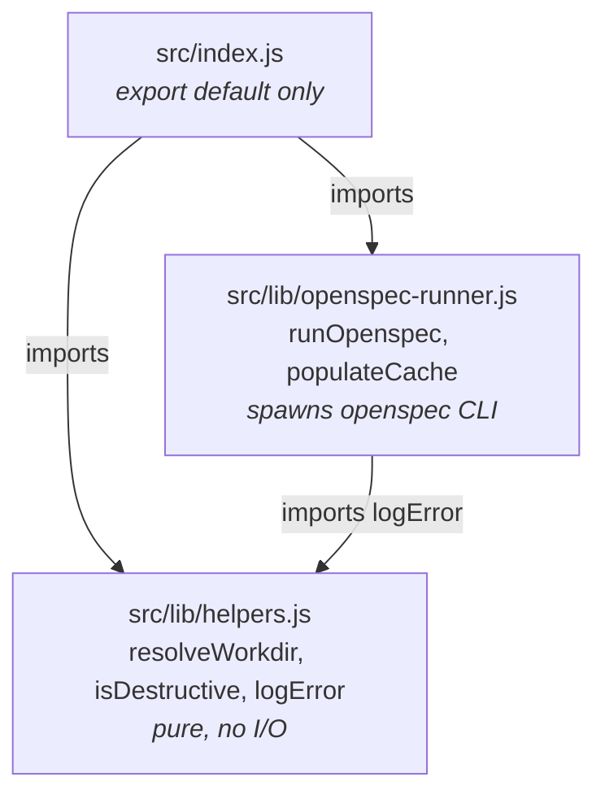

## Context

See `proposal.md` — Why, for the root cause. Design-relevant constraints only:

- **The hazard is the export surface, not the functions.** `opencode-ai@dev` speculatively
  invokes every *named* export of the plugin module with the plugin-factory argument. Any
  named export with a positional, type-assuming first parameter throws, and that throw
  fails the load of the whole file. Reducing `src/index.js` to a single `default` export
  removes the entire attack surface — the moved functions need no defensive parameter
  guards, because nothing will speculatively call them once they are not exported from the
  entry module.
- **Existing module convention.** `src/lib/helpers.js` is documented as *"Pure helpers with
  no external dependencies"* — synchronous, no I/O, no injected `$`. `runOpenspec` and
  `populateCache` are neither pure nor dependency-free (both take the Bun shell `$` and
  spawn a subprocess), so they do not belong there.
- **Test runner is native ESM.** `jest.config.js` sets `transform: {}` and `package.json`
  runs Jest under `--experimental-vm-modules`. A dynamic `import()` therefore yields a real
  ES module namespace object with no `__esModule` interop key — which makes an exact
  `Object.keys` assertion on the export surface viable and precise.
- **Behaviour is frozen.** This is a module-export-shape fix. No tool, hook, or cache
  behaviour changes.

## Goals / Non-Goals

**Goals:**

- `src/index.js` exports exactly one binding: `default`.
- Moved code lands on a module boundary that is justified by a real distinction (I/O vs
  pure), not by taxonomy.
- A regression test encodes the export-surface invariant so this bug class cannot silently
  return when a future contributor adds a convenient named export.
- The `console.*`-free guarantee in the `plugin` capability keeps covering *all* plugin
  source after the file split.

**Non-Goals:**

- Hardening `runOpenspec`/`populateCache` against mismatched-shape arguments. Once they are
  not named exports of the entry module, nothing calls them speculatively; adding guards
  would be defence against a caller that no longer exists (YAGNI).
- Refactoring `populateCache` to call `runOpenspec` instead of inlining its own
  `` $`openspec list --json` `` invocation. It is a real (small) duplication, but changing it
  alters spawn/parse behaviour inside a change scoped to export shape. Defer.
- Reorganising the test suite beyond what the move forces.
- Any change to the `tools` or `system-prompt` capabilities.

## Decisions

### 1. Moved code lives in `src/lib/openspec-runner.js`; `populateCache` stays with `runOpenspec`

Confirmed as proposed, with the module boundary drawn on **side-effect profile**, not on
subject matter: `lib/helpers.js` holds pure, `$`-free functions; `lib/openspec-runner.js`
holds the functions that spawn the `openspec` CLI and shape its output.

Both moved functions sit on the same side of that line, and `populateCache` is a thin
consumer of the same subprocess boundary. Splitting it into a third `lib/cache.js` was
rejected: the cache `Map` is **passed in as a parameter**, not owned by the module, so such
a file would hold one ~20-line function and no state — a module that exists only to satisfy
a naming instinct. The two functions also share exactly one collaborator set (`$`, plus
`logError`), which is the practical test for "same module".



The `openspec-runner` → `helpers` edge (for `logError`) is correct and acyclic: the impure
layer may depend on the pure layer, never the reverse.

**Alternative considered — fold both into `helpers.js`.** Rejected: it would break that
file's stated contract, mix I/O into a module whose tests need no `$` mock, and produce a
single grab-bag `lib/` file that gives no guidance on where the *next* helper belongs.

### 2. `src/index.js` export shape

The entry module imports its collaborators and re-exports nothing:

```js
import { tool } from '@opencode-ai/plugin'
import { existsSync } from 'node:fs'
import { join } from 'node:path'
import { resolveWorkdir, isDestructive, logError } from './lib/helpers.js'
import { runOpenspec, populateCache } from './lib/openspec-runner.js'

// ... factory declared as a plain (non-exported) async function ...

export default OpenSpecPlugin
```

Three specific removals: the `export { resolveWorkdir, isDestructive, logError } from
'./lib/helpers.js'` re-export line, the `export` keyword on `async function
OpenSpecPlugin`, and (by relocation) the `export` on `runOpenspec`/`populateCache`.

Keep the trailing `export default OpenSpecPlugin` with a **named** `async function
OpenSpecPlugin(...)` declaration rather than collapsing to `export default async function
(...)`. Both produce an identical single-key export surface; the named declaration
preserves the function name in stack traces and log output, and keeps the diff minimal.

A file-top comment should state *why* the surface is default-only, so the next contributor
does not helpfully re-add a named export. One line, pointing at this change, is enough.

### 3. Regression test: exact export-surface assertion, in `test/plugin.test.js`

The invariant belongs to the `plugin` capability, whose scenarios already live in
`test/plugin.test.js`. Add a new top-level `describe` block there rather than creating a
`test/module-shape.test.js`: the file already statically imports `../src/index.js`, so the
dynamic import resolves from cache, and a single-assertion file would fragment where a
reader looks for module-contract tests.

The assertion:

```js
const mod = await import('../src/index.js')
expect(Object.keys(mod)).toEqual(['default'])
```

`toEqual` on the full key array — not `toContain`, not a `.default` truthiness check — is
the point: only an exact set assertion fails when someone *adds* an export. Because the
runner is native ESM with no transform, no `__esModule` filtering is needed; if a
transpiling transform is ever introduced, this assertion is the thing that will (correctly)
need revisiting.

This test is the failing-test-first reproduction: it fails on the current tree (which
exports six names) and passes once the fix lands.

**Alternative considered — simulate the loader** by invoking every named export with a
`PluginInput`-shaped object and asserting no throw. Rejected: it tests a *property of the
functions* when the actual contract is *there are no named exports*. It would also pass
trivially forever once the set is empty, and it couples the test to the dev-loader's
current probing behaviour.

### 4. Consequential updates to `test/plugin.test.js`

Three changes, all forced by the move:

- **Split the import on line 8** into `import OpenSpecPlugin from '../src/index.js'` and
  `import { runOpenspec, populateCache } from '../src/lib/openspec-runner.js'`.
- **Extend the `console.*` source scan** (currently reading `src/index.js` +
  `src/lib/helpers.js`). Left as-is it would stop covering the relocated code, silently
  putting a hole in the `plugin` capability's "never writes to console" requirement.
  Prefer **enumerating `src/**/*.js` by walking the directory** over hardcoding a third
  path: the hardcoded list is precisely what just failed, and a future `lib/` module would
  reopen the same hole. It is a few lines and removes a recurring maintenance trap.
- **Leave the `runOpenspec` and `populateCache` describe blocks in `plugin.test.js`**,
  importing from the new module. Strict adherence to the repo's file-per-module test
  convention (`helpers.test.js` ↔ `lib/helpers.js`) would move them into a new
  `test/openspec-runner.test.js` — but those tests depend on `createMock$` and
  `createMockClient`, which live in `plugin.test.js`. Honouring the convention therefore
  means also extracting a shared `test/support/` mock module: real churn inside a change
  whose stated scope is export shape. Accept the convention drift now; record the
  extraction as a candidate for a later change if a third consumer of those mocks appears.

## Risks / Trade-offs

- **Test-file convention drift** (runner tests live in `plugin.test.js`, not a matching
  `openspec-runner.test.js`) → Accepted deliberately and recorded above, with the trigger
  for revisiting it stated (a third consumer of the shared mock factories).
- **Duplicated `openspec list --json` spawn** inside `populateCache` survives the move →
  Explicitly deferred as a Non-Goal; it is pre-existing and behaviour-neutral to this change.
- **The export-surface test is runner-sensitive**: introducing a Babel/SWC transform would
  add an `__esModule` key and break the exact-equality assertion → Acceptable; the failure
  would be loud, immediate, and at the exact place documenting the reason.
- **Fix depends on an observed dev-loader behaviour**, not a published API contract. If the
  loader later stops probing named exports, this change is still correct — a minimal export
  surface is good practice independently — so there is no rollback exposure.
- **A future contributor re-adds a named export** for convenience → Mitigated by the
  regression test (hard failure), the spec requirement being amended in this change, and the
  file-top comment in `index.js`.

## Migration Plan

Not applicable — no persisted state, no consumers of the removed named exports outside this
repo's own tests, and no runtime behaviour change. The change is complete when the full test
suite passes and the plugin loads against an `opencode-ai@dev` prerelease.
