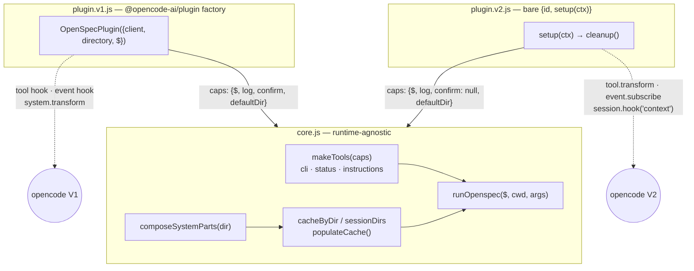
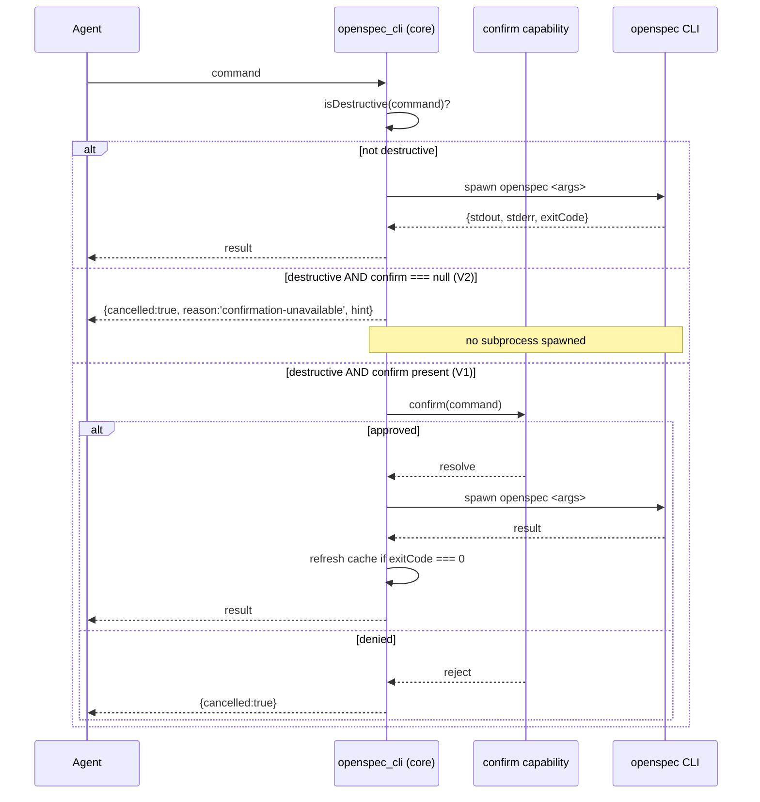

## Context

`opencode-openspec` is currently a V1-only plugin (`@opencode-ai/plugin` factory shape). The
real V2 product (`@opencode/cli` 2.0.x + `@opencode/plugin`) does not run V1 plugin
implementations. This change ports the plugin to V2's `{id, setup(ctx)}` shape while keeping
the V1 adapter working unchanged, following the `core.js` + two-thin-adapters pattern already
established and code-reviewed in three sibling ports (`opencode-use`, `opencode-auto-instruct`,
`opencode-redact`).

Unlike those siblings, this plugin registers **custom tools** and one of them
(`openspec_cli`) gates destructive verbs behind an interactive user confirmation
(`context.ask`). No prior port has needed a tool-level confirmation mechanism, so that is the
one genuinely new decision here — and it turns out to be a real safety decision, not a
mechanical rename.

### Constraints (given)

- No behaviour change for existing V1 users.
- The three existing spec capabilities (`plugin`, `tools`, `system-prompt`) stay authoritative;
  this design only changes *how* they are satisfied per runtime.
- V2 support must fail **loudly** on missing prerequisites, never silently degrade.
- The plugin must never throw into the host and never write to `console.*`.

## Verified V2 API facts

Everything below was read directly from the installed packages
(`@opencode/plugin@0.0.0-dev-19638`, `@opencode/schema`, `@opencode/ai` under
`~/opencode-v2-sandbox/node_modules/`) and from the compiled `@opencode/cli` 2.0.4 binary
(`~/opencode-v2-real/.../bin/opencode`). None of it is asserted from training data.

| # | Fact | Evidence |
|---|---|---|
| F1 | `Tool.Info = {name, input, description, execute(input, Context), output?, options?}` | `@opencode/schema/dist/tool.d.ts` |
| F2 | `Tool.Options = {namespace?, permission?} & ({codemode?: true, pinned?} \| {codemode: boolean, pinned?: never})` | same |
| F3 | Host `Tool.snapshot` partitions tools: `options?.codemode === false` → direct `definitions`; everything else → CodeMode catalog | CLI binary, `Tool.snapshot` |
| F4 | `ToolEditor = {list, get, namespace, add, update, remove}`; `ctx.tool.transform(cb) → Promise<Registration>` | `plugin/dist/promise/tool.d.ts` |
| F5 | **`Tool.Context = {sessionID, agent, messageID, id, progress}` — no `ask`, no `permission`, no `confirm`, and no `directory`/`worktree`** | `schema/dist/tool.d.ts` |
| F6 | `ctx.permission = Pick<PermissionApi, "list" \| "get" \| "reply" \| "rules"> & {hook}` — **`create` is deliberately excluded** | `plugin/dist/effect/permission.d.ts` |
| F7 | `client.permission.create(...) → {id, effect}` exists on the full client and as server route `session.permission.create` → `Permission.ask({...})`; not reachable from a plugin | `client/dist/promise/generated/client.d.ts`; CLI binary |
| F8 | Built-in tools gate themselves *inside* `execute` via an internal Effect service: `yield* permission.assert({action, resources, save, metadata, sessionID, agent, source:{type:"tool", messageID, id}})` | CLI binary (`edit`, `read`, `glob`, `grep`, `webfetch`, MCP wrapper) |
| F9 | `options.permission` (default: tool id) is used by the host **only** to drop a tool from the snapshot when a ruleset entry matches with `resource === "*"` and `effect === "deny"`. It raises no prompt. | CLI binary, `ZUe(action, rules)` |
| F10 | The host's plugin-tool execute path triggers only `execute.before` / `execute.after`. **There is no automatic permission assert for plugin-registered tools.** | CLI binary, `Tool.snapshot().execute` |
| F11 | `ctx.tool.hook("execute.before")` may fail with `Tool.Error` — a plugin can *veto* a call, but cannot prompt | `plugin/dist/effect/tool.d.ts` (`ToolFailures`) |
| F12 | `SessionDomain = Pick<SessionApi, "create"…"context"> & {hook}` — no `form`, no `permission` | `plugin/dist/promise/session.d.ts` |
| F13 | `SessionHooks.context: SessionContext`, `SessionContext.system: Array<SystemPart>`, `SystemPart = {type:"text", text, cache?, metadata?}`, `SystemPart.make = t => ({type:"text", text:t})` | `plugin/dist/promise/session.d.ts`, `@opencode/ai/dist/schema/messages.{d.ts,js}` |
| F14 | `App = {name, version, channel}` — no `log` | `plugin/dist/app.d.ts` |
| F15 | `ShellDomain = {hook: {"create.before": {command, cwd, timeout, shell, env}}}` — observes the built-in bash tool only; **no exec function** | `plugin/dist/promise/shell.d.ts` |
| F16 | `ctx.location: Location.Info = {directory, workspaceID?, project:{id, directory, canonical}}` | `schema/dist/location.d.ts` |
| F17 | `Hooks`/`Transform` return `Promise<Registration>`, `Registration = {dispose(): Promise<void>}` | `plugin/dist/promise/registration.d.ts` |
| F18 | `Plugin.define = (plugin) => plugin` — verified identity function | `plugin/dist/promise/plugin.js` |
| F19 | `ctx.event.subscribe(requestOptions?) → AsyncIterable`, `RequestOptions = {signal?, headers?, onActivity?}` | `client/dist/promise/generated/client.d.ts` |
| F20 | `session.created` event data = `{sessionID, projectID, location: {directory, workspaceID?}, subpath?, parentID?, slug, title?, agent?, model?, metadata?}` | `schema/dist/session-event.js` |

F13, F3, F14, F15, F18 independently confirm briefed facts 4, 2, 8, 5, 7 respectively — they
were re-derived here rather than taken on trust. **F5 and F16 are new findings** that the brief
did not anticipate and that change the design (see D-4).

## Architecture

### D-1 — Shared core plus two thin adapters (recommended)

**Options considered.**

| Option | Trade-offs |
|---|---|
| **A. `core.js` + `plugin.v1.js` + `plugin.v2.js`** | One behaviour implementation, two ~80-line adapters. Matches the reviewed `opencode-use` precedent. Costs one extra module and an explicit capability-injection seam. |
| **B. Single file branching on runtime shape at load time** | No new files, but every behaviour rule grows a runtime conditional; the "identical behaviour" property becomes untestable except through the host. Rejected. |
| **C. Full duplication (two independent implementations)** | Simplest per-file, but doubles the behaviour surface and guarantees drift across four capability specs. Rejected. |

**Recommendation: A.** It is the only option under which "V1 and V2 produce identical CLI
invocations and identical injected content" is a property that can be *asserted in a unit test*
rather than hoped for. Resilience and maintainability both favour a single behaviour
implementation; the cost is one module and one injection seam, which is the minimum needed.

`core.js` is runtime-agnostic and imports nothing from either plugin package. It receives all
host capabilities as plain injected values.



### Hook mapping

| Concern | V1 | V2 |
|---|---|---|
| Tools | `tool` hook, `tool()`/`tool.schema` builder | `ctx.tool.transform(e => e.add({...}))`, plain JSON Schema `input` |
| Events | `event` hook, filter `session.created` | `ctx.event.subscribe({signal})`, detached async iterator |
| System prompt | `experimental.chat.system.transform(_in, out)` → `out.system.push(str)` | `ctx.session.hook("context", e => e.system.push({type:'text', text}))` |
| Shell | `PluginInput.$` | resolve `globalThis.Bun.$` in `setup()`, throw if absent (F15) |
| Logging | `client.app.log` | `process.stderr.write` (F14) |
| Directory | `PluginInput.directory` | `ctx.location.directory` (F16) |

### D-2 — One shared tool-options constant, plus a post-registration assertion

Per F3, a tool descriptor without `options.codemode === false` is silently filed into the
CodeMode catalog and stops being directly callable. This is a *silent* failure mode: the plugin
loads, the tools exist, and the agent simply cannot call them.

`core.js` exports exactly one constant:

```js
export const V2_TOOL_OPTIONS = Object.freeze({ codemode: false })
```

It is applied uniformly to all three descriptors, never re-spelled per call site. After
`ctx.tool.transform(...)` resolves, `plugin.v2.js` re-reads the registered descriptors via
`editor.list()` / `editor.get(id)` and **throws** if any of the three is missing
`codemode === false`. This defensive assertion was code-reviewer-mandated in the `opencode-use`
port and is reproduced here for the same reason: the failure is otherwise invisible.

### D-3 — `$` is injected into core by both adapters

**Options.** (a) each adapter resolves `$` and passes it to core; (b) core resolves
`globalThis.Bun.$` itself; (c) each adapter keeps its own copy of `runOpenspec`.

**Recommendation: (a).** Core stays runtime-agnostic and, critically, *testable with a fake `$`*
— which is the whole basis of the Layer-2 conformance suite (D-7). Option (b) would make core
depend on a Bun global and force every test to monkey-patch `globalThis`. Option (c) duplicates
the one function whose invocation shape the conformance suite exists to pin.

- `plugin.v1.js` passes through `PluginInput.$` unchanged.
- `plugin.v2.js` resolves `globalThis.Bun.$` **once in `setup()`** and throws a named error if
  absent. Failing closed is correct here: every capability this plugin offers depends on
  shelling out to the `openspec` binary, so a plugin that loads without `$` is a plugin that
  answers every tool call with an error. Loud failure at load is strictly better.

### D-4 — Workdir resolution (new finding, not in the brief)

Per F5, V2's `Tool.Context` carries **no** `directory` and **no** `worktree`. The existing
`tools` spec requires resolution order `args.workdir` → `context.worktree` →
`context.directory`, which is V1-shaped and cannot be satisfied verbatim on V2.

**Options.**

| Option | Trade-offs |
|---|---|
| **A. Fall back to `ctx.location.directory` only** | Trivial, but wrong for a V2 server hosting sessions in several directories — every tool call would target the plugin's load directory. |
| **B. Track directory per session from the event stream** | `session.created` already carries `{sessionID, location:{directory}}` (F20), and we already subscribe to it to populate the cache. Add one `Map<sessionID, directory>` and resolve via `Tool.Context.sessionID`. |
| **C. Call `ctx.session.get(sessionID)` per tool call** | Correct and always fresh, but adds a network round-trip to the hot path of every tool call for data we can cache for free. |

**Recommendation: B**, falling back to `ctx.location.directory` on a miss. It costs one `Map`
populated in the handler we are already writing, needs no extra I/O, and preserves the *intent*
of the spec requirement (per-session directory, not per-process directory) on a runtime that
does not expose the V1 fields. The same map lets the `context` hook resolve the right cache
entry from `event.sessionID` — which is actually **more correct than V1**, where the transform
always read the single `directory` captured at factory time.

Core therefore takes `resolveWorkdir(args, { sessionID, defaultDir, sessionDirs })` instead of
V1's `(args, context)`. `plugin.v1.js` supplies `defaultDir = context.worktree ?? context.directory`
per call, preserving exact V1 behaviour.

**Correction from live host verification (real `@opencode/cli` 2.0.3, single-shot `opencode run`
invocations):** the `session.created` event that Option B and the cache-population handler both
depend on **does not fire** for this invocation shape. Instrumenting `ctx.event.subscribe` and
logging every observed `rawEvent.type` for a plain `opencode run "..."` showed the stream go
straight from setup/catalog events to `session.inbox.enqueued` → `session.execution.started` →
… → `session.execution.succeeded` — `session.created` never appears. F20's shape (from the
installed type surface) is real but describes an event that is either host-mode-specific
(e.g. a persistent multi-session server accepting `session.create` API calls) or otherwise not
emitted on this path; static type-surface reading was not sufficient to predict this, matching
the standing lesson in `reality/opencode-v2-sandbox-plugin-compat` that empirical testing is
required for V2 event-vocabulary questions.

Since `ctx.location.directory` is already known and stable at `setup()` time — and per F5
`Tool.Context` has no directory either, confirming one directory per plugin instance is the
correct model for this runtime, not per-session — `plugin.v2.js` now populates the cache
**eagerly at `setup()`** using `ctx.location.directory`, rather than waiting on
`session.created`. The `session.created` subscription and `sessionDirs` map are kept as
defense-in-depth (a persistent multi-session server, if this plugin is ever hosted that way,
may still emit it with a session-specific directory), but the plugin's correctness no longer
depends on that event ever firing. Verified live: the model correctly reported an active change
from injected system-prompt context with zero `session.created` events observed in the run.

## The confirmation-gating decision

This is the one genuinely new, previously unconfirmed decision. It is a safety decision and is
treated as such.

### Finding

**V2 exposes no plugin-reachable equivalent of V1's `context.ask`.** This is not an absence of
documentation — it is a deliberate narrowing, visible in three independent places:

1. `Tool.Context` is `{sessionID, agent, messageID, id, progress}` (F5). No ask primitive.
2. The permission-raising operation exists (`Permission.ask` / `permission.create`, F7) and
   built-in tools use it from inside `execute` (F8) — but `PermissionDomain` is an explicit
   `Pick<…, "list" | "get" | "reply" | "rules">` that **omits `create`** (F6).
3. `SessionDomain` likewise omits `form` and `permission` (F12), closing the other route by
   which an interactive prompt could be raised.

Notably, `Tool.Context` carries `messageID` and `id` *precisely* so a tool can build the
`source: {type:"tool", messageID, id}` field of a permission request (F8) — so the shape is
there, but the call is not handed to plugins. Whether that is a deliberate policy or a gap in
the current dev build is exactly what live verification must settle.

### Options

| # | Option | Assessment |
|---|---|---|
| **A** | Keep the `context.ask` call, optional-chained (`context.ask?.(…)`) | On V2 the call is a no-op and the destructive command executes **unconfirmed**. A silent downgrade of a safety property — the worst outcome available. **Rejected.** |
| **B** | Set `options.permission: "openspec"` and rely on the host | Per F9 this only lets a user *deny-list* the tool wholesale; it raises no prompt. Not a substitute for per-call confirmation. **Rejected as a gate** (see YAGNI-3). |
| **C** | On V2, refuse the destructive path and redirect to the built-in `bash` tool | Destructive verbs return a structured refusal; the agent runs `openspec archive …` via `bash`, which *is* permission-gated by the host's own `assert` (F8). No capability is silently ungated, and the user still sees a confirmation prompt. **Recommended.** |
| **D** | Use `ctx.permission.hook("evaluate", …)` to force `effect: "ask"` | Reactive only. Since nothing asserts a permission for a plugin tool (F10), the hook never fires for our call. Cannot *originate* a prompt. **Rejected.** |
| **E** | Hand-roll an HTTP call to `session.permission.create` | `ctx` exposes no base URL or raw client; reconstructing the server endpoint is undocumented and version-fragile, and it deliberately routes around a narrowing the host authors chose. **Rejected.** |

### Recommendation: Option C — refuse and redirect

On V2, `openspec_cli` executes read-only commands exactly as on V1, and for a destructive verb
returns, **without spawning anything**:

```json
{ "cancelled": true,
  "reason": "confirmation-unavailable",
  "hint": "Destructive openspec verbs are not available through openspec_cli on opencode v2 …
           run `openspec archive <change>` with the built-in bash tool, which prompts for
           confirmation." }
```

This is justified against the four design criteria:

- **Resilience** — the safety invariant ("a destructive openspec command is never run without
  the user agreeing") holds on both runtimes. It is satisfied by a *different mechanism* on V2
  (delegation to `bash`'s own gate) rather than weakened.
- **Clarity and simplicity** — the divergence is one branch in one function, driven by one
  injected capability, and it is visible to the agent in the returned payload rather than
  hidden in the plugin.
- **YAGNI** — no speculative permission machinery is built for a host API that may not exist.
- **Maintainability** — if V2 later exposes an ask primitive, the V2 adapter passes a non-null
  `confirm` and the behaviour converges with zero core changes.

The `openspec_status` and `openspec_instructions` tools are read-only and are unaffected; the
V2 port ships all three tools, not a reduced set.

### Mechanism: a `confirm` capability injected by the adapter

Core never knows which runtime it is on. It knows only whether a confirmation capability was
supplied:

```js
// core.js — shape only
// confirm: null  → no capability on this runtime
// confirm: (command) => Promise<void>  → resolves on approval, rejects on denial
```

| Runtime | `confirm` | Destructive-verb behaviour |
|---|---|---|
| V1 | `cmd => context.ask({permission:'openspec', patterns:[cmd], always:[], metadata:{command:cmd}})` | prompt; on rejection `{cancelled:true}` |
| V2 | `null` | `{cancelled:true, reason:'confirmation-unavailable', hint:…}`, no spawn |

`isDestructive()` (leading-token match, already specified and tested) remains the single
detection point and is unchanged. Crucially, **the destructive-verb check still runs on V2** —
it is what triggers the refusal — so the read-only path is never accidentally gated and the
destructive path is never accidentally executed.



### Open question — requires live verification

**OQ-1.** Confirmed against a running `@opencode/cli` 2.0.3 server (`--standalone`, real
plugin load, real tool call): `Object.keys(toolContext)` from inside a live `execute()` is
exactly `["sessionID","agent","messageID","id","progress"]` — no `ask`, `permission`,
`confirm`, or `directory` field reachable. This confirms the premise the confirmation-gating
decision (Option C) is built on.

**OQ-1 (permission-prompt sub-question) — still open.** Whether registering a tool with
`options.permission: "openspec"` and a matching `{action, resource, effect:"ask"}` rule
produces a genuine V2 prompt, or only deny-filters silently (F9), was **not** independently
re-verified. This does not block or weaken Option C — the refusal path never touches
`options.permission` — but remains an open question for any future capability that might want
a real per-tool confirmation surface on V2.

**OQ-2.** Confirmed: the packaged `.opencode/lib/` layout (with `core.js`/`lib/helpers.js` as
siblings of `.opencode/plugins/openspec.js`, never inside it) loads correctly for a
plain-copied install, exercised across three separate scratch-project live runs.

### Additional load-bearing assumptions verified during `code-reviewer`/`security` review

Two assumptions this decision depends on, but that were not originally cited with a verified
fact (F1–F20), were checked directly against the real installed tools before this change was
considered closed:

- **Bun's `$` tagged-template array interpolation does not shell-reinterpret its elements.**
  Verified with a throwaway script: `Bun.$\`echo ${['hello', '; echo INJECTED', '$(echo X)']}\``
  prints all three array elements literally as arguments to a single `echo` invocation — no
  metacharacter is reinterpreted, no second command executes. This closes the concern that
  `runOpenspec`'s `argsArray` interpolation could allow shell-level command injection or
  evasion distinct from what `isDestructive` sees.
- **The real `openspec` CLI (commander.js-based) is case-sensitive on subcommand names.**
  Verified directly: `openspec Archive ...` and `openspec ARCHIVE ...` both fail with
  `error: unknown command 'Archive'` — confirming `isDestructive`'s case-sensitive
  `tokens[0] === 'archive'` check cannot be bypassed by case variation, since the real CLI
  would reject the miscased form anyway (a case-varied bypass attempt fails at the CLI level,
  not just the gate level).

### Accepted, monitored risk: `isDestructive` is a denylist bounded by current knowledge

`isDestructive` recognises exactly two destructive shapes (`archive ...`, `new change ...`) by
leading-token match. This is a denylist, not an allowlist, and its completeness is bounded by
this file's current, hand-maintained knowledge of `openspec`'s destructive verb surface. If a
future `openspec` release adds a new destructive subcommand (e.g. a hypothetical `delete` or
`reset`), it would execute **unconfirmed on V1** (no `context.ask` gate) and **unrefused on
V2** (no `confirmation-unavailable` refusal) until this file is updated. This is a real,
accepted coupling risk — not a flaw in the gate's control flow (both the check and the actual
argv passed to the CLI are derived from the identical tokenization of the identical input
string, so there is no disagreement between what is checked and what is executed) — and is
recorded here rather than silently assumed complete. A fast, low-cost mitigation worth a future
follow-up: a test that diffs `isDestructive`'s known verb list against `openspec --help`'s
actual subcommand list, so a CLI upgrade adding a new destructive verb fails CI instead of
silently degrading this plugin's safety property.

## YAGNI rejections

| # | Rejected | Reason |
|---|---|---|
| YAGNI-1 | A V2 "permission shim" emulating `context.ask` via polling `ctx.permission.list`/`reply` | Would fabricate a request nothing created (F6, F10); elaborate machinery for a prompt that never appears. |
| YAGNI-2 | A runtime-detection layer that auto-selects the adapter from a single entry point | Adapters are selected by the host's own loader via subpath exports. A detector would add a failure mode with no present need. |
| YAGNI-3 | Setting `options.permission` on the three tools | The action key already defaults to the tool id (F9), so users can deny `openspec_cli` individually or `openspec_*` by glob. A shared key would *reduce* their granularity. |
| YAGNI-4 | An `execute.before` veto hook (F11) as a second safety net | The gate already lives in `execute`; a second enforcement point for the same rule is a drift hazard. |
| YAGNI-5 | Cache TTL / timer-based refresh on V2 | The existing spec deliberately refreshes only on `session.created` and this plugin's own mutations. Unchanged. |
| YAGNI-6 | An abstraction over `SystemPart` shape differences | One adapter pushes a string, the other `{type:'text', text}`. Two lines of adapter code; an abstraction would cost more than it saves. |

## Resilience and operations

| Failure mode | Blast radius | Behaviour |
|---|---|---|
| `globalThis.Bun.$` absent on V2 | plugin only | `setup()` throws a named error at load. Loud, immediate, diagnosable. |
| A tool descriptor loses `codemode:false` | plugin only | Post-registration assertion throws at load rather than the tools silently vanishing from direct call. |
| `openspec` not on `PATH` | single tool call | `{error, exitCode:null}`, logged; no exception escapes (existing `plugin` spec). |
| `openspec list --json` unparseable | injection only | Cache entry stays `{present:true, changes:[]}`; notice still injected, summary omitted. |
| Event-stream iteration throws | event handling | Iteration is wrapped per-event; an unmapped event returns **before any `await`** (V2's stream carries high-frequency `session.text.delta` traffic). A throw is logged and the loop continues. |
| `AbortController` never aborted | host shutdown | Mitigated by disposing every `Registration` and aborting in `setup()`'s returned cleanup (F17). |
| Destructive verb attempted on V2 | single tool call | Refusal payload, no subprocess. Safety invariant preserved. |

**Migration delta.** V1 users see no change. V2 is additive: new `src/core.js`,
`src/plugin.v2.js`, `src/index.js` → `src/plugin.v1.js`, new `package.json` subpath exports and
an optional peer dependency. There is **no runtime import of `@opencode/plugin`** —
`Plugin.define` is a verified identity function (F18) and the package is optional, so
`plugin.v2.js` exports a bare `{id, setup}` object literal, matching all three prior ports.

## Behavioural requirements implied by this design

To be transcribed by the engineer into the delta spec files for the three modified
capabilities. This design does not write `openspec/specs/`.

- **plugin** — the module-shape and safety requirements must be stated so they hold for both
  the V1 factory shape and V2's `{id, setup}`; the "never throws into opencode" requirement
  extends to V2's detached event-subscription loop and to hook disposal on cleanup. The
  "logged via `client.app.log`" phrasing must be generalised (V2 has no `App.log`, F14).
- **tools** — the confirmation requirement must be restated as *"a destructive verb SHALL NOT
  reach a subprocess without either explicit user approval or a refusal returned to the
  agent"*, with two scenarios: confirmation available (prompt; denial → `{cancelled:true}`) and
  confirmation unavailable (`{cancelled:true, reason:'confirmation-unavailable'}`, no spawn).
  The workdir-resolution requirement must be restated in terms of session-scoped directory
  resolution rather than V1's `context.worktree`/`context.directory` fields (D-4).
- **system-prompt** — the injection requirement must be stated independently of whether the
  host receives a bare string or a `{type:'text', text}` part, and the cache lookup described
  as session-scoped rather than bound to a single process-wide directory.

## Component breakdown

| Component | Work kind | Done when |
|---|---|---|
| `src/core.js` — `runOpenspec`, cache + `sessionDirs`, `resolveWorkdir`, `isDestructive`, the three tool behaviours, `composeSystemParts`, `V2_TOOL_OPTIONS` | Application code (JS) | Imports nothing from either plugin package; all host capabilities injected; every behaviour rule has exactly one implementation. |
| `src/plugin.v1.js` (from `src/index.js`) | Application code (JS) | Existing V1 test suite passes unchanged; supplies `confirm` backed by `context.ask` and per-call `defaultDir`. |
| `src/plugin.v2.js` | Application code (JS) | Bare `{id, setup}`; resolves `globalThis.Bun.$` or throws; registers three tools with `V2_TOOL_OPTIONS`; asserts `codemode:false` post-registration; subscribes to events with an `AbortController`; registers the `context` hook; returns a cleanup that disposes every `Registration` and aborts. |
| `src/lib/helpers.js` | Application code (JS) | `logError` takes an injected sink so V2 can route to `process.stderr.write`; `isDestructive` unchanged. |
| `package.json` | Packaging config | Subpath exports for the V1 and V2 entry points; `@opencode/plugin` as an *optional* peer + dev dependency; `@opencode-ai/plugin` peer unchanged. |
| Shared adapter-conformance suite (D-7) | Test code | See below. |
| V2 lifecycle tests | Test code | See below. |
| `docs/v2-compat-audit.md` | Documentation | Rewritten to describe the real port and record the F1–F20 evidence table and OQ-1/OQ-2. |
| Live verification run | Manual verification (V2 host, `--standalone`) | OQ-1 and OQ-2 answered and recorded. |

### D-7 — Test plan

**Layer 2 — shared adapter conformance.** One suite, parameterised over both adapters, driven
by a fake V1 `PluginInput` and a fake V2 `ctx` (fake `tool.transform` editor, fake
`event.subscribe` async iterable, fake `session.hook`, fake `Bun.$` recording invocations).
For each adapter it asserts:

- **Identical CLI invocations** — each of the three tools produces the same argv and the same
  `cwd` for the same inputs (recorded by the fake `$`).
- **Identical returned content** — byte-identical tool results for success, non-zero exit,
  spawn failure, and unparseable JSON.
- **Identical cache population** — a `session.created` event yields the same cache entry for
  present/absent `openspec/` directories.
- **Identical injected content** — the *text* pushed by each adapter is equal after unwrapping
  V2's `{type:'text', text}` envelope; covers present, absent, and cache-miss cases.
- **Asserted divergence, exactly one** — the destructive-verb path. V1 prompts and returns
  `{cancelled:true}` on denial; V2 returns
  `{cancelled:true, reason:'confirmation-unavailable'}`. Both assert **no subprocess was
  spawned**. This test is the executable record of the D-decision above and must fail loudly if
  either side drifts.

**V2-specific lifecycle tests.**

- `setup()` throws a named error when `globalThis.Bun.$` is absent.
- All three descriptors carry `codemode:false`; the post-registration assertion throws when one
  is tampered with.
- `setup()`'s cleanup disposes every `Registration` and aborts the event controller; a second
  cleanup call is a no-op.
- Event resilience: unmapped high-frequency event types (e.g. `session.text.delta`) return
  before any `await`; a handler throw is logged and the loop continues; abort ends iteration
  cleanly.
- `resolveWorkdir` prefers `args.workdir`, then the session-scoped directory, then
  `ctx.location.directory`.
