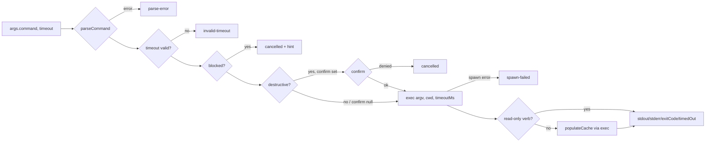

# Design

## Context

See proposal.md for the motivation. The current state that shapes this design:

- `core.js` builds argv with `split(/\s+/)`. It classifies destructive verbs on `tokens[0]` only, so a leading
  global option (`--no-color archive x`) skips both the V1 confirmation and the cache refresh.
- Every subprocess goes through the host-supplied Bun `$`: V1 gets it as a factory input, and V2 reads
  `globalThis.Bun.$`. `$` has no timeout or kill API. A `Promise.race` timeout would leave the child
  running, so an `archive` could finish after the tool had already reported failure. V2's eager cache
  population uses exactly this race today.
- `src/lib/openspec-runner.js` duplicates `runOpenspec` and nothing imports it.
- Verified against openspec 1.14.0 with no TTY: pickers and prompts refuse with guidance, and
  `archive <name>` proceeds without `--yes`. Commands that still hang or reach outside the project are:
  `config edit` ($EDITOR), `workset open` (editor or agent session), `completion install|uninstall`
  (edits shell rc files), `feedback` (sends data to a third party), `store remove` (deletes a local
  folder), and `workset remove` (deletes a saved workset; member folders are left alone).
- Global options (`openspec --help`) are `--no-color`, `-V/--version` and `-h/--help`. None of them
  takes a value. The only group-level option that takes a value is `config --scope <scope>`.

User decisions, taken as given: V2 runs destructive verbs without a plugin-level confirmation. V1 keeps
`context.ask`, and V1 has no other constraints. `openspec_cli` gains an optional `timeout`. Commands that
would hang fail fast.

## Goals / Non-Goals

**Goals:**

- One code path tokenizes, classifies and executes a command, so the classifier and the argv can never
  disagree.
- No tool call blocks forever. A timeout kills the process and does not leave it running unseen.
- Every refusal or failure returns a structured result with a stable `reason` code, and never throws
  from inside the tool.

**Non-Goals:**

- Sandboxing or policy-enforcing the CLI. Host permissions are the gate (see Risks).
- Shell features: no expansion of variables, `~` or globs, and no pipes, redirects, `;` or `&&`.
- Wiring a host abort or cancel signal into the child (not verified for either runtime; defer).
- Windows process-tree kill (best-effort single-process kill only; no Windows requirement stated).

## Decisions

### D1. One tokenizer and resolver in `helpers.js`

`parseCommand(command)` returns `{ ok: true, argv, verb, subverb }` or `{ ok: false, reason, error }`.

- It first runs `normalizeCommand` (the existing zero-width stripping), then a POSIX-like lexer:
  - whitespace separates arguments;
  - text inside `'…'` is literal;
  - inside `"…"`, a backslash escapes only `"` and `\`;
  - outside quotes, a backslash escapes the next character;
  - adjacent segments concatenate (`--x="a b"` becomes one argument), and `''` gives an empty argument.
- Errors are `parse-error` for an unterminated quote, a trailing backslash, or an empty command.
- If the first token is literally `openspec`, it is stripped once.
- `verb` is the first token that does not start with `-`, so leading global options are skipped.
- `subverb` is the next such token after the verb. The value of a known value-taking option is skipped
  (currently only `--scope`, in both its `--scope X` and `--scope=X` forms).
- `isDestructive`, the blocklist, the read-only allowlist and the argv passed to the process all use
  this result.

Why classification is good enough even when it is imperfect: every misclassification falls back to a
safe outcome. An unknown or misread verb is treated as "not read-only", so the cache refreshes. A
hanging command that the blocklist misses is ended by the timeout (D4). The only thing a
misclassification can cost is V1 confirmation, which the user does not require.

Alternatives considered:

- Keep whitespace splitting. Rejected because it mangles quoted arguments, which is the core defect.
- Use an npm shell-quote library. Rejected: it adds a dependency for a lexer of about 40 lines, and those
  libraries also implement expansion and operator semantics that we do not want.
- Run through `sh -c`. Rejected because it would allow injection and expansion.

### D2. Command classification tables (data in `helpers.js`)

| Class | Entries | Effect |
| --- | --- | --- |
| **blocked** | `config edit`, `workset open` (reason `interactive`); `completion install`, `completion uninstall`, `feedback` (reason `out-of-scope-side-effect`) | Refused before spawning, with `{ cancelled: true, reason, error, hint }`. The hint tells the user to run the command in their own terminal. |
| **destructive** | `archive`, `new change`, `store remove`, `store unregister`, `workset remove`, `config reset`, `config unset` | V1 confirms these with `context.ask`. V2 executes them. |
| **read-only** | `version`, `help`, `list`, `view`, `show`, `validate`, `status`, `instructions`, `templates`, `schemas`, `context`, `doctor`; `change show\|list\|validate`; `spec show\|list\|validate`; `config path\|list\|get`; `schema which\|validate`; `store list\|ls\|doctor`; `workset list\|ls`; `completion generate`; no verb (only `-h` or `-V`) | No cache refresh afterwards. |

Every other command runs, and the cache refreshes afterwards.

A bare help request (`<verb> [<subverb>] -h|--help`, nothing else except `--no-color`) counts as read-only
and is never blocked or gated. A help flag anywhere else can be an option value (`feedback hi --body -h`)
or an operand after `--`, so it grants no exemption (found in security review).

Position on the side-effect verbs (recommended):

- Block `feedback` and `completion install|uninstall`. No OpenSpec agent workflow needs them. `feedback`
  is a ready-made channel for prompt injection to send data to a third party. `completion` edits user
  shell config outside the project. Refusing them costs nothing that anyone currently needs (YAGNI
  applied to the permission surface).
- Allow `store remove` and classify it as destructive. Managing stores is legitimate OpenSpec state
  management, but it deletes a folder that may hold unpushed work. Classifying it as destructive gets it
  V1 confirmation and lists it in the docs.
- Allow `workset remove`, `store unregister`, `config reset|unset`, classified destructive so V1 confirms them (code review).
- There is no escape hatch or override flag (YAGNI). A user who really wants a blocked command can run
  it in a terminal.

Alternatives considered:

- (a) Block only the hang cases and allow everything else. Rejected: it leaves the data-exfiltration
  path through `feedback` open for little benefit.
- (b) Block everything with side effects outside the project, including `store remove`. Rejected: that
  contradicts "full CLI support" for store management.

### D3. Execution moves to `node:child_process`, injected as the `exec` capability

`exec(argv, { cwd, timeoutMs })` returns `{ stdout, stderr, exitCode, timedOut }` and rejects only when
the process cannot be spawned (for example ENOENT). The default implementation lives in a new
`src/lib/exec.js` and works like this:

- `spawn('openspec', argv, { cwd, stdio: ['ignore','pipe','pipe'], detached: true, env: process.env })`;
  no shell is involved;
- the child inherits the environment unchanged, which avoids the Bun `.env()` pitfall of replacing the
  whole environment;
- on timeout it sends SIGTERM to the process group (`process.kill(-pid)`), and after a 2 s grace period
  it sends SIGKILL;
- the result is settled when the process closes. If the child still has not closed after SIGKILL plus
  the grace period, the result is settled anyway, so the tool can never hang.

Both adapters pass `exec` in `caps`. `runOpenspec`, `populateCache` and all three tools use it.
**`$` is no longer used at all.** V1 ignores the `$` it receives, and V2 drops the
`globalThis.Bun.$` precondition. V2's eager population passes `timeoutMs: EAGER_CACHE_TIMEOUT_MS` and
deletes its `Promise.race`, so the child is now actually killed. `src/lib/openspec-runner.js` is
deleted.

Alternatives considered:

- Keep `$` and use `Promise.race`. Rejected because the child keeps running after the timeout.
- Keep `$` only for `populateCache`. Rejected: two execution paths and two sets of test fakes, with the
  cache path still unbounded on V1.
- `Bun.spawn`, which has native `timeout` and `killSignal`. Rejected: Jest runs under Node, so tests
  would need injection anyway, and `node:child_process` works under both Bun and Node with no runtime
  check.

Testing: test files fake `exec`, the same way they fake `$` today. Tests of `exec.js` itself spawn a
real `node -e` child to cover the timeout and kill paths.

### D4. The `timeout` argument

- `openspec_cli` accepts `timeout`: an integer number of milliseconds, optional, default `120000`,
  minimum `1000`, maximum `600000`.
- A value outside that range, or one that is not an integer, returns `{ error, reason: 'invalid-timeout',
  exitCode: null }` and nothing is spawned. Rejecting is better than clamping because it never surprises
  the caller.
- `openspec_status` and `openspec_instructions` use the default internally and do not expose the
  argument (YAGNI).
- On expiry, the tool returns `{ stdout, stderr, exitCode: null, timedOut: true, reason: 'timeout',
  error, hint }` with any partial output it captured.
- The value is declared once in `TOOL_SCHEMAS` as JSON Schema, which V2 uses directly. V1 mirrors it
  with `tool.schema.number().int().min().max().optional()`.

### D5. Gating and cache refresh

- Destructive commands:
  - when `caps.confirm` is set (V1), the tool calls it and returns `{ cancelled: true }` if the user
    denies;
  - when `caps.confirm` is `null` (V2), the command executes;
  - the `confirmation-unavailable` branch is removed.
- Order of checks:
  1. parse the command, then validate the timeout;
  2. check the blocklist, then confirm a destructive command;
  3. run `exec`;
  4. refresh the cache if needed.
- Cache refresh happens after **any non-read-only command that was spawned**, whether it exited 0,
  exited non-zero or timed out. A failed or killed `archive` may still have moved files, and the refresh
  is a single cheap `list --json`.

### D6. Result `reason` codes

All of the following are additive: the existing `{ stdout, stderr, exitCode }` and
`{ error, exitCode: null }` shapes still hold.

| reason | When |
| --- | --- |
| `parse-error` | The tokenizer fails. |
| `invalid-timeout` | The `timeout` argument is out of range or not an integer. |
| `interactive` / `out-of-scope-side-effect` | The command is blocked (returned with `cancelled: true`). |
| `timeout` | The process was killed after the timeout. |
| `spawn-failed` | The process could not be started, for example because `openspec` is not on PATH. |

### D7. No cap on output size

The output of `openspec` is bounded by the size of the repository's specs and changes, and the process
cannot run longer than the timeout. A cap would add a truncation contract for no observed problem.
Revisit if a real `show --json` of a large repo causes problems for the host or the context window.

### D8. Documentation

- `TOOL_DESCRIPTIONS.openspec_cli` must state that:
  - quoting is supported, and there is no shell expansion;
  - `timeout` is available;
  - which commands are blocked and why;
  - destructive verbs need confirmation where the host supports it, and otherwise execute directly;
    users should configure host permissions for `openspec_cli`.
- README: recommend host `permission` configuration for `openspec_cli` (exact syntax per host docs), and
  list the blocked and destructive tables.
- README must also state the residual prompt-injection risk: on V2, text an agent reads (specs, issues,
  fetched pages) can lead it to archive or create changes without a prompt.
- `docs/v2-compat-audit.md`: rewrite the confirmation-gating section.

## Risks / Trade-offs

- [V2 destructive commands run unconfirmed, including commands triggered by prompt injection] → document
  the risk, recommend host permissions, keep `archive` reversible through git, and block `feedback`
  (the exfiltration channel).
- [A future openspec release adds an interactive or out-of-scope verb] → the timeout bounds any hang,
  and unknown verbs refresh the cache. The blocklist is a small table that is easy to extend.
- [A new value-taking option shifts `subverb` resolution] → classification falls back safely (see D1).
  The only possible loss is V1 confirmation.
- [Killing a process group with `detached: true` has to be done correctly] → it is covered by real
  child-process tests. If `process.kill(-pid)` throws (for example on Windows), the code falls back to
  `child.kill()`.
- [Removing the `$` dependency changes the adapter inputs] → V1 still accepts `$`, just unused, so the
  host contract is unchanged. In V2, removing the Bun precondition only loosens it.
- [Timeout in the middle of an `archive` leaves a partial state] → the result reports `timedOut`, the
  cache refreshes, and the hint tells the agent to inspect `openspec list` and the git status.

## Migration Plan

- Breaking for V2 users: commands that used to be refused now run. Release notes must say how to add a
  host permission rule for `openspec_cli`.
- No data migration. To roll back, revert the release.
- Housekeeping (outside this design's write scope):
  - the `AGENTS.md` gotcha line needs updating, and that is an instruction file, so it routes to
    `agent-engineer`;
  - PR #1 is superseded.

## Component Breakdown

| Part | Kind of work | Done when |
| --- | --- | --- |
| `parseCommand` and the classification tables in `helpers.js`, with `isDestructive` rebuilt on them | Application code and unit tests | Quoting, escapes, error, `openspec`-prefix, leading-option and `--scope` cases pass; `--no-color archive x` counts as destructive. |
| `src/lib/exec.js` (spawn, timeout, group kill) | Application code and real-child tests | A sleeping child is killed within the timeout plus grace, partial output is returned, and an ENOENT spawn rejects. |
| `core.js`: the `exec` capability, the D5 pipeline, `reason` codes, refresh rule, schemas and descriptions; delete `openspec-runner.js` | Application code and tests | Every row in D6 has a test, and no test fakes `$` any more. |
| Adapters (V1: `exec` and the `timeout` argument; V2: `exec`, drop the Bun precondition and the race) | Application code and tests | The V1/V2 divergence assertion in the conformance test is gone, and both adapters behave the same apart from confirmation. |
| README, `v2-compat-audit.md`, release note | Documentation | D8 content is present. |
| `AGENTS.md` gotcha line | Instruction file (route to `agent-engineer`) | The line reflects the new V2 behaviour. |
